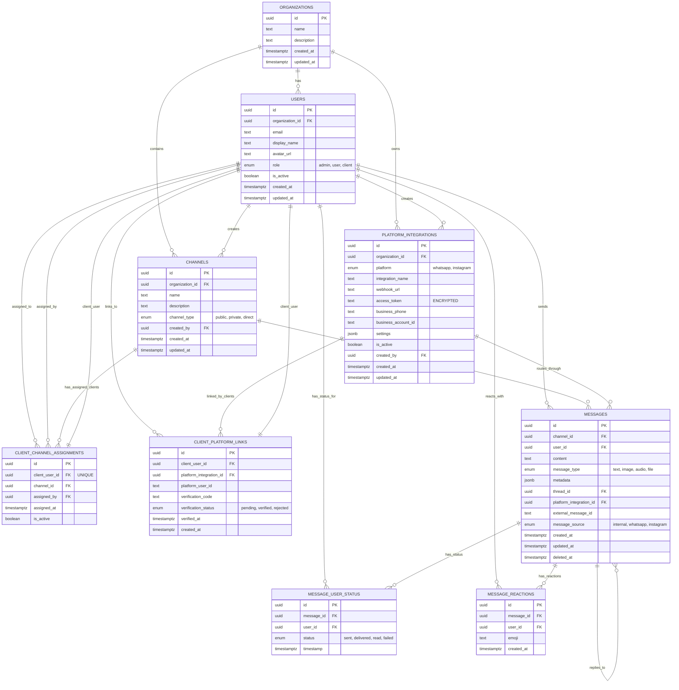

# Messaging System ER Diagram



## Key Relationships Explained

### **1. Organization Level**
- **Organizations** own **Platform Integrations** (WhatsApp Business, Instagram Business)
- **Organizations** contain **Channels** and **Users**

### **2. User Management**
- **Users** have roles: `admin`, `user`, `client`
- **Client Users** have 1:1 relationship with **Channels** via `CLIENT_CHANNEL_ASSIGNMENTS`
- **Client Users** can link multiple platforms via `CLIENT_PLATFORM_LINKS`

### **3. Message Flow**
- **Messages** belong to **Channels** and are sent by **Users**
- **Messages** can route through **Platform Integrations** (for WhatsApp/Instagram)
- **Messages** have per-user status tracking via `MESSAGE_USER_STATUS`

### **4. Integration Logic**
- **Platform Integrations** are org-level (not channel-level)
- **Client Platform Links** connect client users to platform integrations
- **Client Channel Assignments** determine which channel receives messages

## Data Flow Example

```
WhatsApp Message from +1234567890
    ↓
Look up CLIENT_PLATFORM_LINKS (platform_user_id = +1234567890)
    ↓
Find client_user_id = 'client-123'
    ↓
Look up CLIENT_CHANNEL_ASSIGNMENTS (client_user_id = 'client-123')
    ↓
Route to channel_id = 'support-channel-456'
    ↓
Create MESSAGE record with:
    - channel_id: 'support-channel-456'
    - user_id: 'client-123'
    - platform_integration_id: 'whatsapp-integration-1'
    - message_source: 'whatsapp'
```

## Unique Constraints

1. **CLIENT_CHANNEL_ASSIGNMENTS.client_user_id** - Each client assigned to only one channel
2. **CLIENT_PLATFORM_LINKS(client_user_id, platform_integration_id)** - One link per platform per client
3. **CLIENT_PLATFORM_LINKS(platform_integration_id, platform_user_id)** - One platform account per integration
4. **MESSAGE_USER_STATUS(message_id, user_id)** - One status per user per message

This design ensures clean 1:1 client-to-channel mapping while supporting multiple platform integrations per organization.